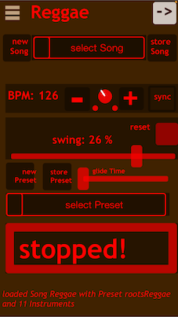

# GM accompaingnant application

A midi accompaignant application for mobiles created with [Pure Data](https://puredata.info/) and [MobMuPlat](https://danieliglesia.com/mobmuplat/).

You need an multitimbral Soundmodule or Keyboard to use it, the app does not produce any sound itself. You could also install [plugdata](https://plugdata.org/) and setup your DAW to use your favourite plugins.

## Basic Functionality Overview

The app takes the midi input and analyses played notes as chords to provide scales used by different instruments accompaigning you. Also rules for direct MIDIn to MIDIout can be defined.

- The accompaigning instruments use unique midi channels.
- Songs with different Presets can be stored, some examples (like styles) are included
- MIDI control messages for each parameter can be assigned.
- Individual instrument settings can be stored and called separately.
- The velocity of incoming midi is used to control parameters of the sequencer's behaviour transforming it into other musical parameters. If you play loud the sequencers play many notes for example.
- The heavy usage of random and probability aims to mimic a more lively interactive musical experience: As a user you don't create an accompaigning track, but you define rules how the accompaigning instruments behave according to your live performance.

## For whom is this?

I created this to have more fun while practicing scales or chord progressions on the piano. Due to the ability to create Songs and Presets you can also use it as One-manband or solo entertainer.

## Usage

Unfortunately MobMuPlat is already quite outdated, so a new Platform to run this app will have to be found soon.

Install MobMuPlat on your [iOS](https://apps.apple.com/de/app/mobmuplat/id597679399) or [android device](https://danieliglesia.com/mobmuplat/MobMuPlat-signed.apk), download this repo zipped and open it on your device. More info [here](https://danieliglesia.com/mobmuplat/).

## Documentation

...is planned, though still missing, feel free to open an issue if you have questions or contact me directly.

## Copyright notice

The code in this patch is licensed under Creative Commons Attribution-NonCommercial. However, the concept, idea, or functionality represented by this patch remains under copyright of Reinhard Jordan, and any use of the concept in other works requires permission.